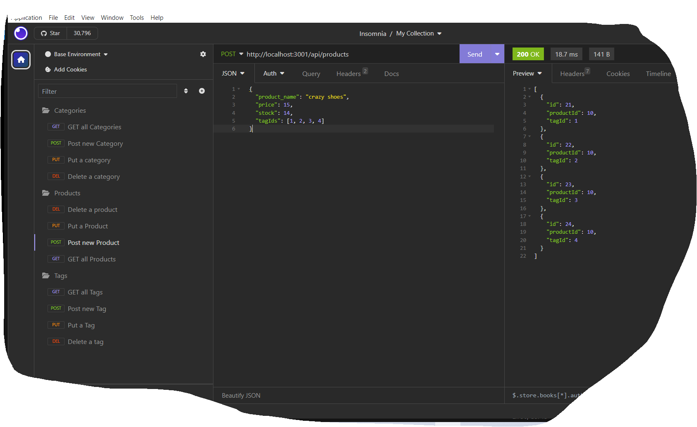

# E-Commerce Back End

## Description

This project will build the back end for an e-commerce site. It will configure a working Express.js API to use Sequelize to interact with a MySQL database.

## User Story

```md
AS A manager at an internet retail company
I WANT a back end for my e-commerce website that uses the latest technologies
SO THAT my company can compete with other e-commerce companies
```

## Acceptance Criteria

```md
GIVEN a functional Express.js API
WHEN I add my database name, MySQL username, and MySQL password to an environment variable file
THEN I am able to connect to a database using Sequelize
WHEN I enter schema and seed commands
THEN a development database is created and is seeded with test data
WHEN I enter the command to invoke the application
THEN my server is started and the Sequelize models are synced to the MySQL database
WHEN I open API GET routes in Insomnia for categories, products, or tags
THEN the data for each of these routes is displayed in a formatted JSON
WHEN I test API POST, PUT, and DELETE routes in Insomnia
THEN I am able to successfully create, update, and delete data in my database
```
## Usage

To view a demo of this application, please view to demo located at https://watch.screencastify.com/v/DB5zzQas7hbq31eHCNky

## Source

My repo, is located at <https://github.com/mcgreevyjim66/E-Commerce-Back-End>.
There is source code located in the E-Commerce-Bak-End folder.

## Mock-up




## Credits

Author: Jim McGreevy
Date:   9/29/2023

